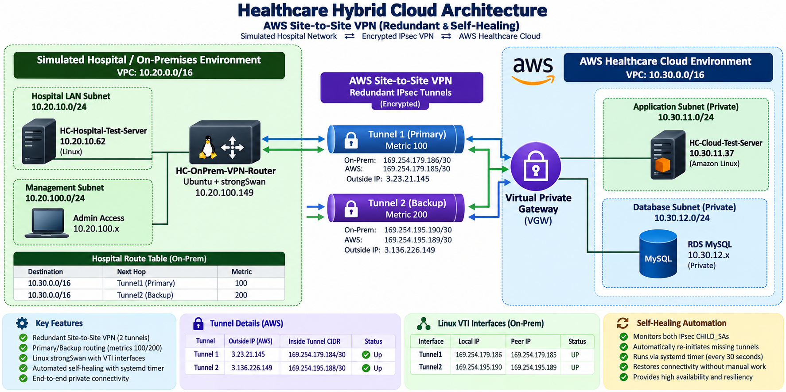
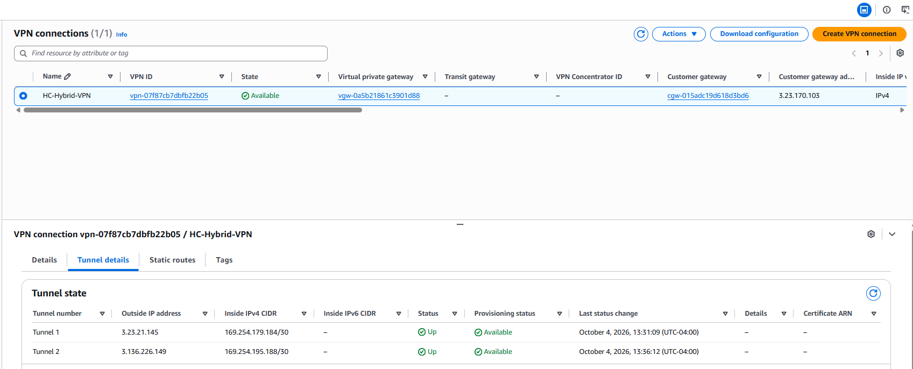
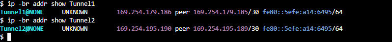
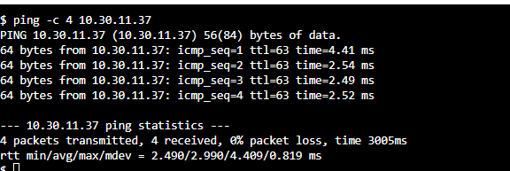
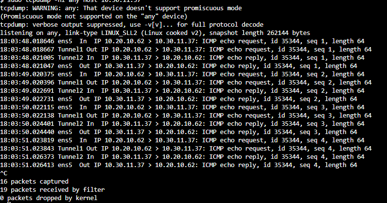
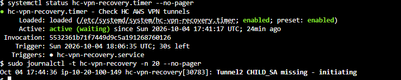

# Enterprise Healthcare Hybrid Cloud Architecture on AWS



## Project Overview

This project demonstrates the design, implementation, troubleshooting, and validation of a simulated **enterprise healthcare hybrid-cloud architecture** connecting an on-premises hospital environment to Amazon Web Services (AWS).

The solution uses a redundant **AWS Site-to-Site IPsec VPN** with two encrypted tunnels between a simulated hospital network and an AWS healthcare cloud environment.

The project goes beyond establishing basic VPN connectivity by implementing:

- Redundant IPsec VPN tunnels
- Linux Virtual Tunnel Interfaces (VTI)
- Primary/backup route selection
- Private workload-to-workload communication
- VPN failover
- Packet-level traffic validation
- Persistent Linux networking configuration
- Automated IPsec tunnel recovery
- AWS Systems Manager private management connectivity
- Network troubleshooting using Linux diagnostic tools

---

# Business Scenario

A healthcare organization operates workloads inside an on-premises hospital network while also hosting applications and services in AWS.

The organization requires secure private connectivity between the two environments without exposing internal workloads directly to the public Internet.

The architecture was designed to provide:

- Encrypted hybrid-cloud communication
- Redundant VPN connectivity
- Automatic recovery from tunnel failures
- Private AWS workloads
- Centralized administrative access
- High availability
- Network visibility and troubleshooting capabilities

---

# Architecture

The environment consists of two major networks.

## Simulated Hospital / On-Premises Environment

**VPC CIDR**

```text
10.20.0.0/16
```

Primary components include:

- Hospital workload subnet
- Management subnet
- Linux hospital test server
- Ubuntu VPN router
- strongSwan IPsec
- Linux VTI interfaces
- Static routing

The hospital test workload used during validation:

```text
HC-Hospital-Test-Server
10.20.10.62
```

The VPN router uses Ubuntu and strongSwan to simulate an enterprise customer-premises VPN appliance.

---

## AWS Healthcare Cloud Environment

**VPC CIDR**

```text
10.30.0.0/16
```

The cloud environment contains private AWS workloads accessible through the hybrid connection.

The primary cloud test workload used during validation:

```text
HC-Cloud-Test-Server
10.30.11.37
```

The architecture also includes private application/database network segmentation and AWS management services.

---

# AWS Site-to-Site VPN

Connectivity between the hospital environment and AWS is provided by an **AWS Site-to-Site VPN**.

Two IPsec tunnels provide redundant paths.

| Tunnel | Role | Route Metric |
|---|---|---:|
| Tunnel1 | Primary | 100 |
| Tunnel2 | Backup | 200 |

Tunnel1 is preferred during normal operation because it has the lower route metric.

Tunnel2 remains available as the secondary path.



*Both AWS Site-to-Site VPN tunnels operational and available.*

---

# Linux Virtual Tunnel Interfaces

Linux VTIs were configured on the Ubuntu VPN router to provide route-based connectivity through the IPsec tunnels.



The VTI design allows standard Linux routing to determine which encrypted VPN tunnel carries traffic.

This provides greater visibility and control over the hybrid routing path.

---

# Primary and Backup Routing

Two routes to the AWS cloud network were configured:

```text
10.30.0.0/16 → Tunnel1 → Metric 100
10.30.0.0/16 → Tunnel2 → Metric 200
```


Under normal conditions, Linux selects Tunnel1.

If the primary route becomes unavailable, Tunnel2 can carry the traffic.

---

# End-to-End Private Connectivity

Connectivity was validated between the simulated hospital workload and the private AWS cloud workload.

Source:

```text
10.20.10.62
```

Destination:

```text
10.30.11.37
```



Testing produced:

```text
4 packets transmitted
4 packets received
0% packet loss
```

This demonstrates successful private communication across the Site-to-Site VPN.

---

# Packet-Level VPN Validation

Connectivity was also validated using `tcpdump` on the Ubuntu VPN router.



The capture demonstrated the complete traffic path:

```text
Hospital Server
10.20.10.62
       |
       | ens5 IN
       v
Ubuntu VPN Router
       |
       | Tunnel1 OUT
       v
AWS Site-to-Site VPN
       |
       v
Cloud Server
10.30.11.37
       |
       | Tunnel1 IN
       v
Ubuntu VPN Router
       |
       | ens5 OUT
       v
Hospital Server
```

The packet capture confirmed that traffic was actually traversing the VTI/IPsec path rather than simply relying on VPN console status.

---

# VPN Failover Testing

Redundancy was tested by temporarily removing the preferred Tunnel1 route.

Normal operation:

```text
Hospital Network
      |
      v
Tunnel1
Metric 100
      |
      v
AWS
```

During the controlled failure:

```text
Hospital Network
      |
      X  Tunnel1 route unavailable
      |
      v
Tunnel2
Metric 200
      |
      v
AWS
```

The hospital workload maintained connectivity with the AWS cloud workload through Tunnel2.

Tunnel1 was subsequently restored as the preferred path.

This validated functional VPN redundancy rather than simply confirming that both AWS tunnels displayed an UP status.

---

# Automated VPN Self-Healing

During long-term testing, the VPN infrastructure revealed an additional operational scenario: IPsec CHILD_SAs could disappear while the strongSwan service itself remained running.

Rather than relying on manual intervention, a lightweight automated recovery mechanism was implemented using **systemd**.

The recovery process:

```text
systemd timer
      |
      v
Check IPsec CHILD_SAs
      |
      +---- Healthy ----> No action
      |
      +---- Missing
              |
              v
       swanctl --initiate
              |
              v
       Tunnel restored
```

The recovery timer checks the VPN state every **60 seconds** and initiates a missing CHILD_SA when necessary.



A controlled failure test was performed against Tunnel2.

The CHILD_SA was intentionally terminated and was subsequently detected and restored by the recovery service without manual initiation.

---

# Persistence

Custom systemd services were created so the Linux VTI configuration survives system reboots.

The persistent configuration restores:

- Tunnel1 VTI
- Tunnel2 VTI
- VTI addressing
- Interface MTU
- IP forwarding
- VTI kernel parameters
- Primary cloud route
- Backup cloud route
- Required policy-routing behavior

A complete VPN-router reboot was performed after implementation.

Both VTIs, both AWS VPN tunnels, routing, and private workload connectivity successfully returned.

---

# Troubleshooting Case Study

One of the most important parts of this project involved diagnosing a routing problem after the IPsec tunnel had already established successfully.

## Symptom

The hospital test server could not reach:

```text
10.30.11.37
```

Initial testing resulted in:

```text
100% packet loss
```

However, packet captures on the VPN router showed ICMP packets arriving from the hospital workload.

This indicated that the problem was not simply a security-group or source-server issue.

---

## Investigation

The Linux routing decision was inspected using:

```bash
ip route get 10.30.11.37
```

Instead of selecting Tunnel1, Linux returned a path through the VPN router's normal network interface.

Further investigation showed:

```bash
ip rule show
```

included policy routing through:

```text
table 220
```

Inspection of the table showed a default route through the normal `ens5` gateway.

Meanwhile, the correct VPN route existed in the main routing table:

```text
10.30.0.0/16 dev Tunnel1 metric 100
```

Because policy table 220 was evaluated before the main routing table, traffic destined for the AWS cloud network was being captured by the wrong routing decision.

---

## Resolution

The conflicting default route was removed from table 220.

The routing decision was then verified again:

```bash
ip route get 10.30.11.37
```

Traffic correctly selected:

```text
dev Tunnel1
```

A subsequent packet capture showed:

```text
ens5 IN
Tunnel1 OUT
Tunnel1 IN
ens5 OUT
```

End-to-end communication was successfully restored.

---

# Additional Tunnel Recovery Troubleshooting

Several days after initial deployment, AWS reported both VPN tunnels as DOWN even though strongSwan remained running.

strongSwan logs showed that the AWS peer remained reachable and was exchanging Dead Peer Detection traffic.

Manual CHILD_SA initiation successfully re-established the IPsec data path.

This behavior led to the implementation of the automated recovery service described above.

The result was a more resilient VPN design capable of detecting and recovering missing CHILD_SAs automatically.

---

# Management Connectivity

Private AWS instances were configured for management using **AWS Systems Manager**.

Private DNS and VPC endpoint connectivity were used so administrative access did not require directly exposing private workloads through public IP addresses.

This provided a more secure management model for the cloud environment.

---

# Security Considerations

Security practices implemented or demonstrated in the project include:

- Private RFC1918 workload addressing
- IPsec encryption between environments
- Private AWS workloads
- Security-group traffic restrictions
- Network segmentation
- AWS Systems Manager administration
- VPC endpoint connectivity
- Redundant encrypted tunnels
- Removal of credentials from public documentation

VPN pre-shared keys and other sensitive authentication material are intentionally excluded from this repository.

---

# Technologies Used

## AWS

- Amazon VPC
- Amazon EC2
- AWS Site-to-Site VPN
- Virtual Private Gateway
- Customer Gateway
- AWS Systems Manager
- VPC Interface Endpoints
- Security Groups
- Route Tables
- Private Subnets

## Linux

- Ubuntu Server
- strongSwan
- `swanctl`
- Linux VTI
- `iproute2`
- systemd
- `tcpdump`
- Linux policy routing

## Networking

- IPsec
- IKEv1
- Static routing
- CIDR subnetting
- Route metrics
- Policy routing
- Dead Peer Detection
- VPN redundancy
- VPN failover
- Packet analysis

---

# Skills Demonstrated

This project demonstrates practical experience with:

- Hybrid-cloud network architecture
- AWS networking
- Site-to-Site VPN deployment
- Linux routing
- IPsec configuration
- Network redundancy
- Failover testing
- Packet capture analysis
- Policy-routing troubleshooting
- AWS private networking
- Systems Manager connectivity
- Linux service management
- Infrastructure persistence
- Network automation
- Operational troubleshooting

---

# Project Validation Summary

| Test | Result |
|---|---|
| Tunnel1 established | PASS |
| Tunnel2 established | PASS |
| Both AWS tunnels UP | PASS |
| Tunnel1 preferred route | PASS |
| Tunnel2 backup route | PASS |
| Hospital → AWS private ping | PASS |
| 0% packet loss validation | PASS |
| Packet path verified with tcpdump | PASS |
| Tunnel2 failover | PASS |
| Primary route restoration | PASS |
| VTI persistence after reboot | PASS |
| IPsec recovery after reboot | PASS |
| Automated CHILD_SA recovery | PASS |

---

# Key Takeaways

The most valuable part of this project was not simply creating an AWS VPN.

The project required troubleshooting interactions between:

```text
AWS routing
Linux routing
Policy routing
IPsec
strongSwan
Virtual Tunnel Interfaces
Security controls
System services
```

The final architecture provides redundant encrypted connectivity, deterministic primary/backup routing, persistent Linux network configuration, packet-level validation, and automated recovery of failed IPsec security associations.

This project demonstrates the type of troubleshooting and systems-level thinking required when operating hybrid enterprise networks.

---

## Disclaimer

This environment was created as a technical portfolio/lab project.

IP addresses, credentials, pre-shared keys, account information, and other sensitive configuration values should be sanitized before publication.
